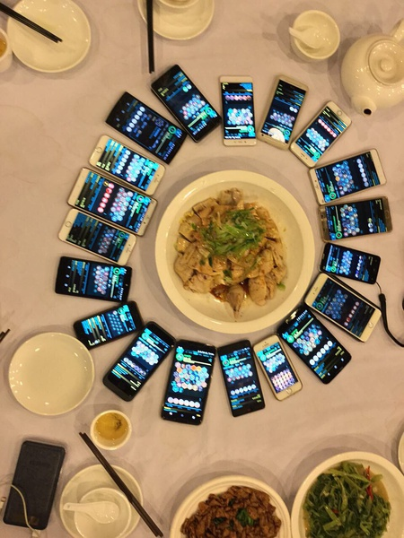

# Ingress Biocard 2016 制作指南(图像制作及印刷指导)

这是为 Ingress Agent 所制作的 Biocard 制作指导, 包含了比较详细的单步操作介绍. 主要面向有简单 PhotoShop 使用经验的人.

这篇指南由来自中国广州的 agent @nyagalin 撰写.  
这篇指南在 CC BY 协议下发行, 在此我授予所有人以自由地存储, 展示, 再创作, 翻译此内容的权利. 但为了读者可以及时获得对此内容的勘误, 我衷心建议至少保留到 gitbook 本家的链接.  

## 如果你还不是一名 Agent ...
Ingress 是由前 Google 成员 Niantic Lab 开发的 LBS(Location Based Service) 手机游戏. 通过官方网站 [ingress.com](https://www.ingress.com/) 以及搜索引擎, 你可以了解到更多详细信息.  
Biocard 是由 Ingress 官方倡议的, 玩家自由制作的 **玩家名片**. 在游戏过程中与其他玩家交换, 以表示你曾经与该玩家碰面, 并将此物留作纪念.  

我们热诚地欢迎你加入我们的行列.  

