# 制作步骤 Making

## 正面图像预制作

### 构图

首先要选择一张合适的图片, 目的是使得在嵌入六角形框的时候 "看起来比较舒服大气".  
构图的方法有很多, 在此介绍一种适合萌新使用的方法:

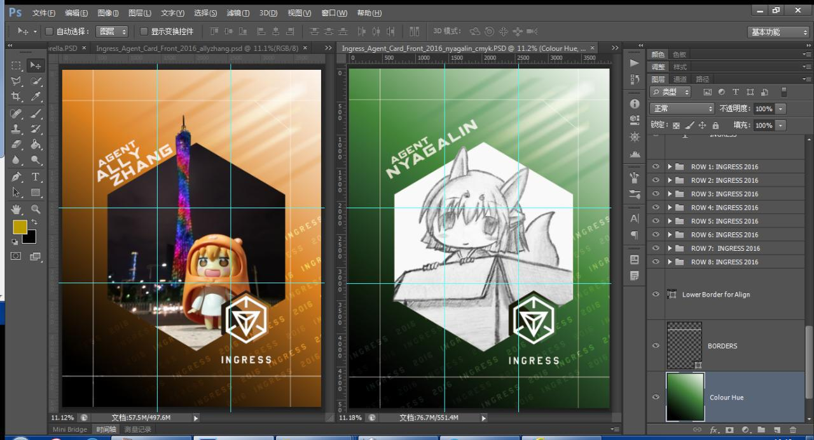

在图片上打九宫线(三等分 或 黄金分割), 一个合格的 "大气" 图片需要呈上三角形轮廓, 占据三个以上的交点, 
或者能沿水平或垂直线排布.

然后这是反例:

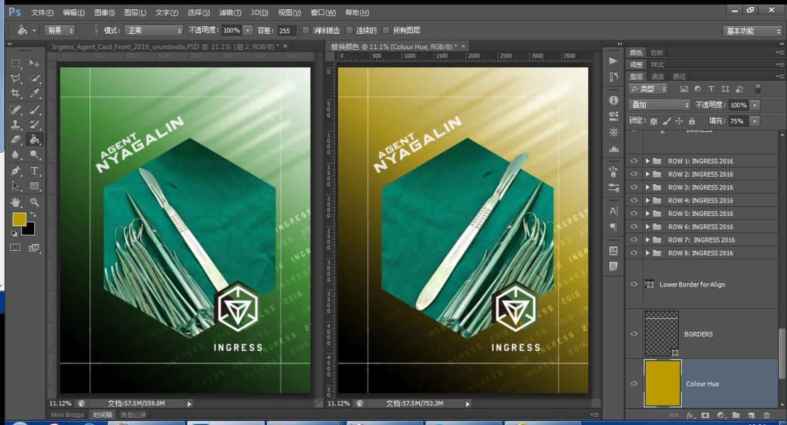

图片主体过于薄弱; 主体旁边有比主体更抢眼的物体; 背景色比前景色饱和度高.

### 修图

作为素材的图像通常都需要修正和增强才能使用. 
修正的方法和步骤千差万别, 但有大概的方向:

 1. 突出主体弱化背景 (比如下图中使用调整图层降低天空颜色的饱和度
 2. 除去乱入物体/修正拍摄瑕疵 (比如下图中使用画笔盖掉 TNT 的商标 (并没有展示出来

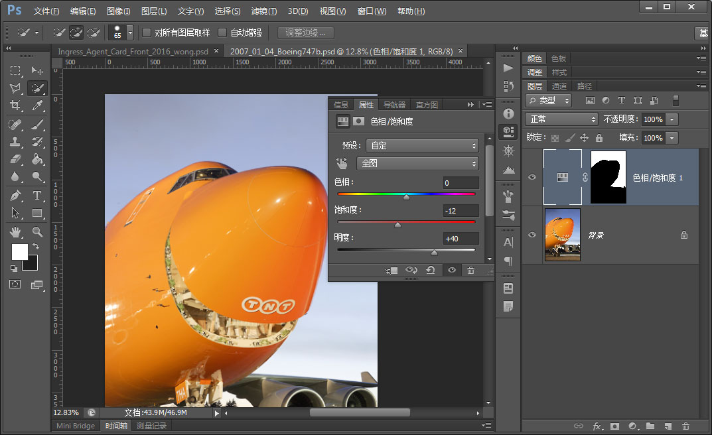

 1. 完成之后保存 PSD. 
 2. 使用 _历史记录_ 面板的 _从当前状态新建文档_ 按钮制作一份副本. 
 3. _拼合图层_ 之后备用. 

## 模板

模板分正反, 但主要工作量在正面, 背面主要是填字的工作.

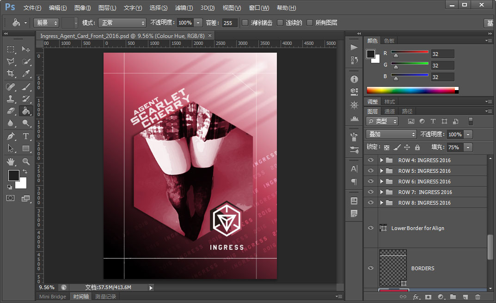

正面的模板打开后如图, 四边的白线是裁剪线. 
关于裁剪线唯一需要注意的是, 除了预定要溢出裁剪边沿的元素, 其他内容都不要进入裁剪线内边沿的 3mm(按 dpi 换算后大概是 150px) 以内. 
裁剪线内外 3-5 毫米(具体值取决于承印厂的技术水平和稿件本身的尺寸)的区域称为出血位. 因为印刷都是在一张全开纸上面排满要印的文档然后再裁开的. 出血位就是保留给裁剪机的误差的. 
文档的背景一定要超过出血位的外边沿, 以保证裁剪后不会出现白边.
文档主要内容一定要保持在出血位的内边沿以内, 以保证不会被裁剪掉.

另一个需要说明的是 Hexagon 图层(六角形叠加套色的部分), 这个模板演示了官方的单色漫画风格是如何制作的. 

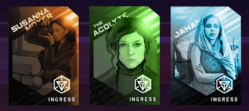

这种效果是通过将主体图像去色后, 再用这个叠加的刷色层上一层氛围色. 
接下来我们主要讲解全彩 biocard 的制作, 所以这个图层可以隐藏掉.

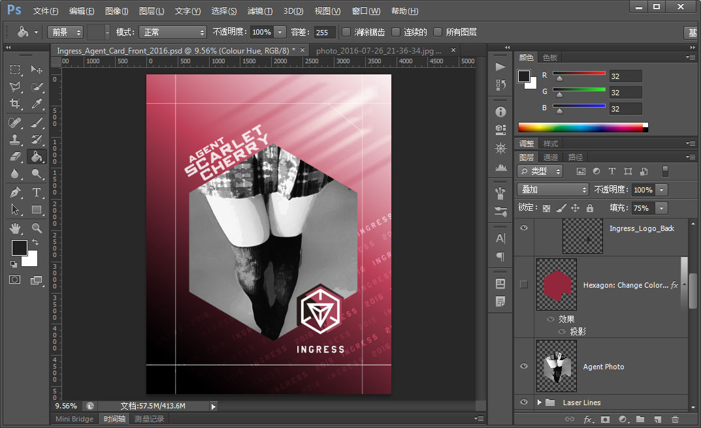

### 蒙版抠图

了解这个模板是如何工作之后就可以动手魔改了. 改之前记得保存副本, 避免万一改崩回不来了.  
_从当前状态创建文档_ 是个非常好的工具.

原图的主体图像是直接就是六边形的, 但对于数学不太好的人来说要将一个图裁剪成正六边形并不是一个容易的事. 
下面介绍一种更优良的方法:

 1. 复制图层 Hexagon, 位于 Agent Photo 之上, 命名为 Clip-Mask-Bottom, 设置为可见.
 2. 右键图层 Clip-Mask-Bottom, 选择 _选择像素_.
 3. 使用 _油漆桶_, 纯白, 流量100, 容差255, 将选择区填满.

到目前为止你的屏幕大概是这样, 右边图层的顺序和我描述的顺序不一样, 
但其实没有关系, 如果你只打算做全彩的卡, 那么 Hexagon 和 Agent Photo 图层现在可以丢进垃圾桶了.

从上一节中将我们已经制作好, 合并图层的文档中复制图层到模板中

 4. 复制图层到模板, 位于 Clip-Mask-Bottom 之上, 命名为 Avatar
 5. 右键 Avatar 图层, 选择 _创建剪贴蒙版_

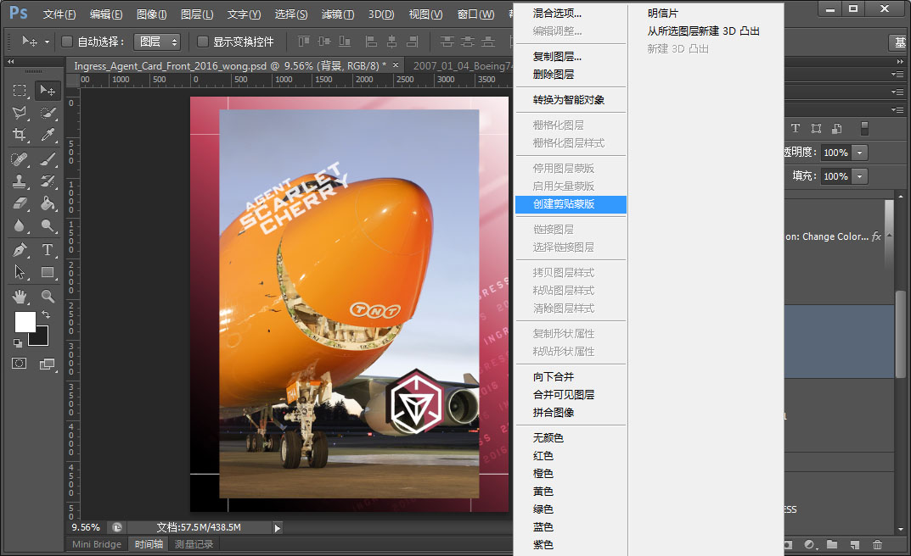

执行此操作后会变成如下效果:

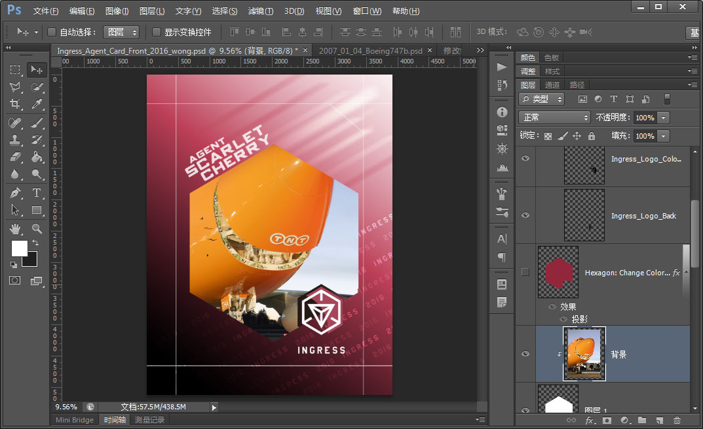

如果你选用的图像小于图框且带有透明层, 那么你还需要:

 6. 抠出边沿
 7. 对图层 Clip-Mask-Bottom 使用 _油漆桶_ 调整为你想要的背景色.

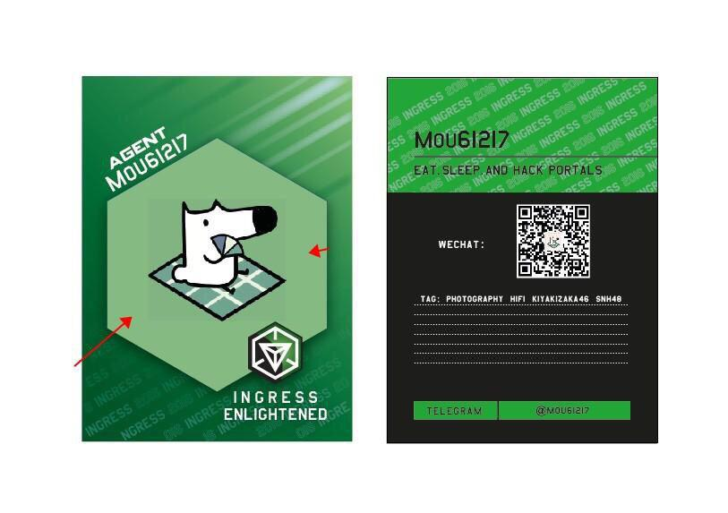

如果不打算做溢出图框效果, 可以跳过下面部分章节.

## 图框溢出

图框溢出是指如图的猫巴耳朵突出图框, 达到透视3D的效果:

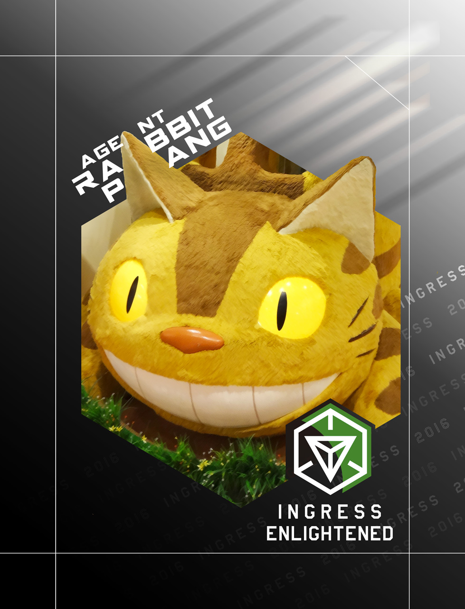

 1. 首先 _复制图层_ Avatar, 位于 Avatar 之上, 命名为 Avatar-Overflow, 取消此图层的 _剪贴蒙版_
 2. 使用 Shift 键选取 Avatar 和 Avatar-Overflow 图层, 右键, 选择 _链接图层_.
 3. 来回切换 Avatar-Overflow 的可见性, 拖动和缩放图层以重新构图. 
    构图时要注意出血位, 以及为左上角 Agent Name 留出足够空间.

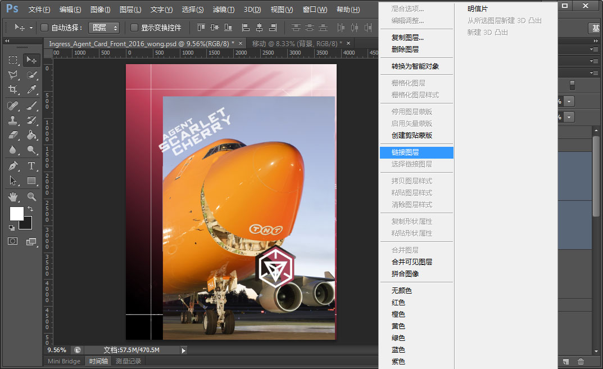

_链接图层_ 的作用是将变形类操作应用到同一组已链接图层. 这意味着你可以不用选择全部图层再进行拖动或缩放.

 4. 确定构图之后, 选择 Avatar-Overflow 图层, 在 _图层_ 面板, 选择 _创建图层蒙版_
 5. 利用图层蒙版开始抠图, 只抠出需要溢出的部分即可.

抠图的方法根据图像内容千差万别, 这不属于此文章的讨论范围, 请通过搜索引擎自行寻找答案.

完成后的状态如图, 注意各图层的状态:

## 调整主题色

 1. 在图层面板拖动到底部, 找到并选择 Colour Hue 图层.
 2. 使用 _图像_ > _调整_ > _替换颜色..._ 打开如图界面
 3. 颜色容差最大, 在画布内随便什么地方点一下.
 4. 拖动底下的滑块可着劲儿地折腾吧!

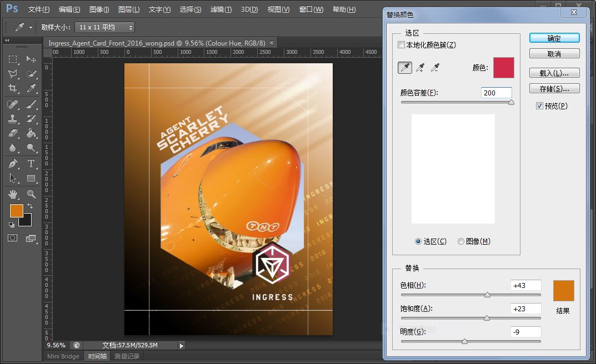

当然你也可以用油漆桶一发入魂, 但不建议这么做. 没有色度学知识和经验的人很难驾驭大块颜色. 
上述方法是专业插画师使用的上色方法, 更加直观和快捷.

调整的时候注意不要取用过高的饱和度. 印刷时候使用油墨, 照排机参照你给出的颜色使用油墨调色, 
如果你使用的颜色饱和过高, 照排机可能会使用过重的颜色油墨, 导致一种化妆过度的效果.

顺带一提要记住所选择的三个参数, 并且对下方的 Ingress 图标应用一次相同的操作.

## 单色漫画风格

即官方人物卡的风格, 我并没有实际做过这种, 但可以说出来大概要怎么做.

 1. 提取出 Avatar 和 Avatar-Overflow 的轮廓, 并保存选区备用.
 2. 在 Avatar-Overflow 之上, _图层_ > _新建调整图层_ > _黑白_.
 3. 选择 调整图层 的 图层蒙版, 应用在第一步中保存的选区. 这步的目的是只黑化主体图像. 保持模板本身的颜色.
 4. 打开 Hexagon 图层的 _可视性_, 用 _吸管_ 和 _油漆桶_ 将原有颜色填满整个图层.
 5. 给 Hexagon 图层叠加一层图层蒙版, 应用在第一步中保存的选区.
 6. 将 Hexagon 图层和 调整图层 加入到已有的链接图层组中.
 7. 选择 Hexagon 图层, 参照上一节介绍的 _替换颜色_ 方法调整刷色.

如果没有做图框溢出, 那么上述有些步骤是可以简化的, 在此不再累叙.

## 反面

基本没有什么技术难点, 操作方法和正面类似. 
以下只介绍一些经验:

 * description 是两个文本框, 模板作者在此使用了回车手动断行.
   但你可以 右击文字图层 > _转换为段落文本_, 然后这个文本图层的行为就表现得像 MSOffice 的传统文本框了.
 * 调整图层的文本和段落参数可以有效改善排版效果.
 * 在 _段落_ 面板 的 _连字_ 复选框 可以关闭英语的连字符功能.
 * 如果使用中文, 推荐以下字体: 华文黑体, 冬青黑体, 兰亭细黑, 或者 方正的黑体.
   无论如何不要使用微软雅黑或微软正黑, 亦不要使用衬线字体(会影响成品效果)
 * 如果排版有困难, 可以尝试将 Ingress 图标移动到右下角. 将两个文本图层统合成一个.
 * ITEM PASSCODE 是四个图层, 我不是很明白作者这么做的用意, 于是我替换成一个 PASSCODE 了.
 * 参照上一节介绍的 _替换颜色_ 方法调整刷色.

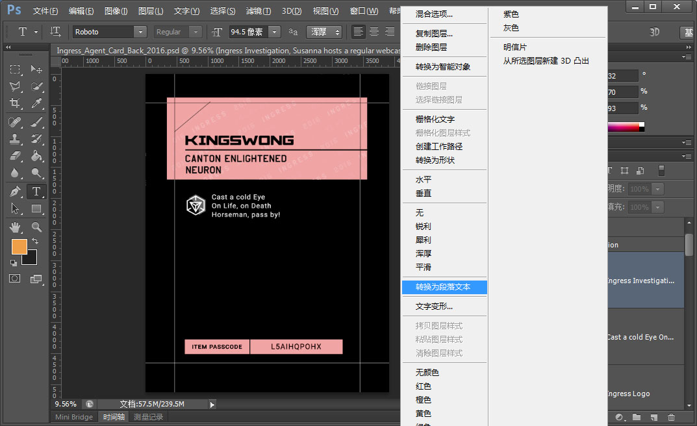

全部完成之后就可以使用 _窗口_ > _双联垂直_ 检查结果了.

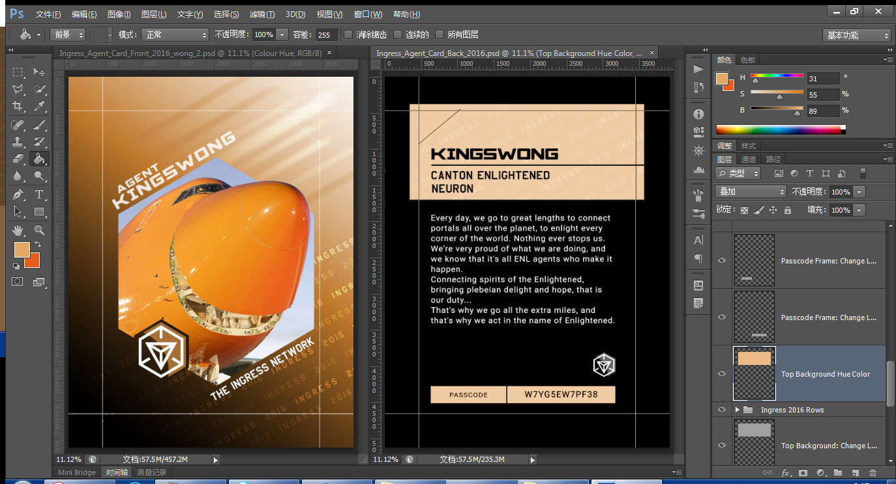

如果屏幕的色彩还原能力不高, 则你还可以尝试一下曲线救国的方法,
使用 _文件_ > _存储为web使用的格式_ 或者直接导出 位图, 然后传送到手机或 tablet 上进行审定. 
这么做的前提是你的设备色彩还原能力较强, 通常来说使用 索尼, 三星, 苹果 的制造技术制作的屏幕更为可靠.
其他厂牌的状况请自行咨询老司基.
