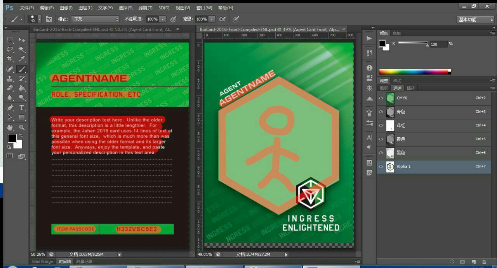

# 必备要件 Prerequisites

要制作 Biocard , 你需要准备以下这些东西:

 * 具有较强图形运算能力的计算机
   PSD 档的规格为 4K+@1200dpi, 你需要相当的内存才能流畅地完成工作.
 * 表现力较强的显示器
   因为最终需要付梓, 所以能正确表现颜色是相当必要的.
 * PhotoShop
   只要不是太旧的版本都 OK, 笔者使用 PS CS6.
   对于中国大陆的在读大学生, 可以通过 赛尔校园先锋 [shop.edu.cn](http://item.shop.edu.cn/series?id=17) 以很低廉的价格购买 PS CS6 的使用许可.
 * 模板
   由 [Micheal Mok](https://plus.google.com/116443177855967587433) 提供的 PSD 模板. 有两个可供选择的下载点:
   * [Google Drive](https://drive.google.com/drive/folders/0B8UJIedIxPKENVN3bUFSWmpYcFE) 由 Barton Lo 提供, 也是我最开始取得源文档的地方.
   * [Baidu Yun](http://yun.baidu.com/s/1i5NNS4t) 由 agent @RedBeann 提供, 但只包含 PSD, 你需要从前者那里(或者通过搜索引擎)下载所需要的字体才能正常工作.
   请记得向他们道谢.
 * 用于卡片正面的图像
   可以是一张照片(三次元, 要求 2 Mega Pixels 以上), 一张卡通图片(二次元, 要求 1.5MP 以上), 或者矢量图片(导出路径或者位图)
   建议使用自己创作或摄制的图像. 使用他人或广泛流行的图片可能会导致你的卡片与他人发生碰撞, 且你有面临侵权指责的危险.
 * 一些印刷学的知识
   将随后文提及.

如果你正在帮他人制作卡片, 除 正面图像外, 你还需要让他们尽快决定及提供以下内容:

  * agent codename
  * role in
  * description
  * passcode 或者 其他用于替换passcode栏的信息
  * 正面主题色(可选，或根据主体图像由制作者配色)
  * 背面氛围色(可选，或根据正面主题色/图像主题色由制作者配色) 

以下这张图片解释了你需要向你的甲方索要的信息:

   
