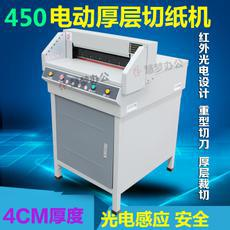
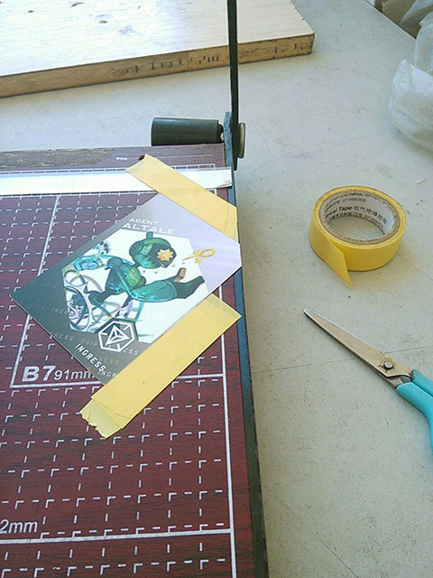

# 付梓 Printing

印刷通常需要提交 CMYK 制式文稿, 因为印刷使用的是四色油墨. (模板使用的是 RGB 制式)
从 RGB 转换成 CMYK 通常需要自己完成, 盖因 CMYK 和 RGB 所能表达的色域不一样, 以及两者的颜色混合算法不一致. 
所以这项工作 **一定要亲自完成** 以保证能把握印刷效果.

另外, 还有一些其他要求:

 * 像素密度达到 600 dpi 以上. 提供的模板是 1200 dpi, 已经满足要求
 * 文字要求保留非栅格化以便在排印时重新计算字形(否则会在缩放时出现锯齿).
   提供的模板是 1:1 制作, 所以即使栅格化也因为无需缩放保证不会出现锯齿.
 * 保留出血位, 以及验证内容的裁剪安全. 
   我们在之前的制作过程已经提及过这个事项. 
   负责任的印刷服务商会在付印时再一次校稿, 并警告你可能存在的危险.
 * 单色黑和四色黑. 
   某些程序(已知的有GIMP)在转换黑色的时候会转换成四色黑(用四色油墨模拟的黑色)而不是单黑(用黑色油墨直接印刷黑色). 
   四色黑在视觉上有种不纯的感觉. 在印刷套色不准确的时候, 边沿会有红蓝眼镜般的迷幻效果.
   检查的方法是将颜色面板调整为 CMYK 表示, 使用吸管在应该为黑色的地方取样, 
   如果与色板右下角的标准黑色读数不一致即不是单黑.
 * 图层不能合并, 或者说能不合并的尽量不要合并.

以上为针对 Biocard 以及此模板所专门列出的常见注意事项. 
有一位台湾的印刷商对于印刷常见问题制作了专门的指导条目, 是以上规则的超集. 如有需要可以自行校对. 

http://www.ok888.com.tw/html/worksetting_words.asp
  
## 正面

 1. 保存已经做好的 RGB 制式稿.
 2. 使用 _历史记录_ 面板的 _从当前状态创建新文档_ 复制一份新文档.
 3. 保存副本为 Ingress_Agent_Card_巴拉巴拉_cmyk.psd

然后开始手动合并图层

 4. 复选 Colour Hue 和 Gradient 图层, 使用 _合并图层_
 5. 如果使用单色漫画风格, 则可以选择合并从 Hexagon 到 Clip-Mask-Bottom 图层.
    理论上灰度图层叠加颜色不会出现失真(只是理论上

然后开始转换为 CMYK

 6. _图像_ > _模式_ > _CMYK颜色_  
    如果提示需要拼合图层, 选择 _不合并_.
    如果提示选择选择颜色配置文件, 接受默认选项, 笔者的默认选项是 _Japan Color 2001 Coated_.
 7. 等待其完成, 并保存.

注意一旦生成的稿件需要修改, 需要在 RGB 稿件上修改然后重新生成 CMYK. 
不能修改 CMYK 后转换成 RGB.

## 背面

制作副本的步骤同上.

然后开始手动合并图层:

 1. 将两个 Passcode Frame Hue Color 图层向下移动并 **分别** 和它们所上色的底图层合并. 
    注意是只分别合并两个图层, 不要将中间的图层裹挟进去.
 2. 将 从 Top Background Hue Color 到 Top Background: Change Lighter/Darker 之间的图层全部合并.

转换 CMYK 的步骤同上.

## 付印

目前广泛使用的印刷参数如下:

 * 300 克双铜板纸,
 * 覆哑膜,
 * 成品尺寸 64 * 89 mm

但就目前的走访而言, 即使是同样的参数, 不同提供商的原料质量和工艺水平有明显差异. 
争议主要在成品强度方面. 

建议拟制作 biocard 的玩家自行咨询社区的老司基, 且索要他们的 biocard 检查是否符合自己的心理期望.

## 剪角

因为比较麻烦而且质量无法承诺, 印刷提供商通常不会承担剪角的操作. 
解决方案有二:

买或者向店家借用一个这个:

只要三千六百八.

或者, 买或者向店家借用一下这个:

像这样找一张官方卡作为模, 然后用比较厚的胶带限位. 就可以相对高效地完成这个工作了. 
如果件数比较多, 建议找个同伴一边聊天一边做, 否则可能内心黑化把持不住.

> Galin Nya, [29.07.16 09:46]
> 400张
> 意识开始涣散
> 
> Galin Nya, [29.07.16 09:46]
> [人呢好寂寞来个人理我呀好恐怖哦新人正在慢慢得死去]
> 
> Galin Nya, [29.07.16 10:12]
> 接近500张
> 内心开始黑化
> 想给康总的脸来一刀
> 
> Galin Nya, [29.07.16 10:45]
> 接近600张
> 一切归于无
> 菩提落叶化泥尘 几度轮回几度人
> 百卷烦恼随风去 清净灵台了无痕

(所以正常的速度是 200-300 张/小时, 包含休息稳定心神的时间.

## 最佳实践

以下是广萌在制作 biocard 过程中接洽的一些品质优秀的提供商.
提供的商品和服务质量可能因为时间而变化, 请咨询社区的老司基后自行决定是否采用.

 * 大容量卡册: https://detail.tmall.com/item.htm?id=10817975390  
   用于为交换的卡片提供大容量存储, 另外还可以用于存储车票/地铁票卡等

 * 小容量卡册: http://www.muji.com.cn/cn/store/goods/4548718615155  
   用于外出时携带收集得到的卡片

 * 卡盒: http://www.muji.com.cn/cn/store/goods/4945247506822  
   用于外出时携带用于送出的卡片

